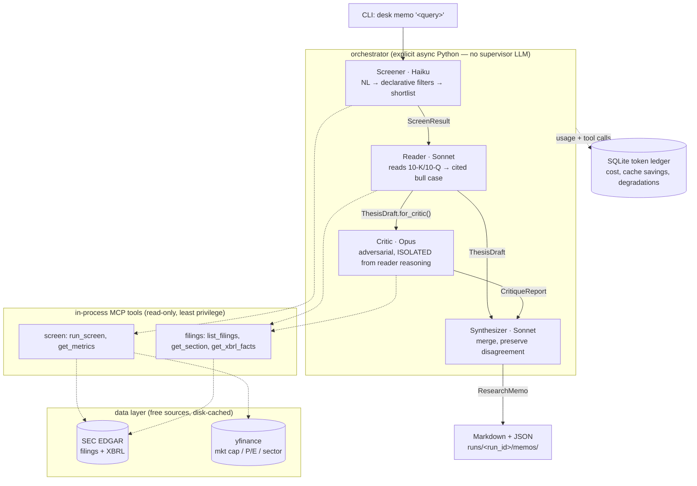

# Multi-Agent Stock Research Desk

A CLI-driven multi-agent system that turns a natural-language screening request
(*"find undervalued mid-cap industrials with improving margins"*) into a **structured, cited
equity-research memo** (Markdown + JSON). Four agents are orchestrated by explicit Python — not
by a supervisor LLM — over the [Claude Agent SDK](https://code.claude.com/docs/en/agent-sdk/python).

> ### ⚠️ Disclaimer
> This project is an **engineering demonstration of multi-agent orchestration**. Nothing it
> produces is investment advice or a recommendation to transact in any security. It generates no
> trading signals, price targets, or buy/sell/hold recommendations — only descriptions of
> evidence and disagreement drawn from public SEC filings. Every generated memo carries this
> disclaimer in its footer.

The project exists to produce **measurable engineering findings**, not stock picks:

- Does multi-agent beat a single-agent baseline on memo quality? By how much, at what cost?
- Where do agent-to-agent handoffs fail? (Every handoff is a typed, versioned, logged contract.)
- Can per-agent token budgets + model tiering + prompt caching control cost without hurting quality?

---

## Architecture

Four agents, each an independent Claude Agent SDK `query()` call with its own model, system
prompt, and least-privilege tools. The **only** thing that crosses a stage boundary is a
validated Pydantic contract artifact — parsed, schema-checked, and semantically verified
(citations must resolve to cached filing passages; quotes must match; tickers must be in-universe),
with one repair retry before a recorded `HandoffFailure`.



Per-ticker `reader → critic → synthesizer` chains run concurrently (bounded semaphore). Before
each stage a **budget controller** checks the run's running token total against per-stage caps and,
if exceeded, engages a degradation ladder (reduce tool truncation → drop model tier → limit
filings); a hard cap flags `budget_exhausted`. Every model call and tool call is logged to a
SQLite ledger; dollar cost is recomputed from `config/pricing.yaml` so tier experiments re-price
consistently.

### The critic-isolation control

The Contrarian Critic attacks the bull case **without seeing the reader's chain of reasoning** —
`ThesisDraft.for_critic()` deterministically drops the thesis summary and confidence language,
passing only the claims + citations. This is the sycophancy control; `--handoff full_context`
toggles it off for A/B measurement (`desk eval critic` quantifies the delta).

---

## Quickstart (first memo in ≤ 10 minutes)

**Requirements:** Python ≥ 3.11 (3.12 recommended) and [`uv`](https://docs.astral.sh/uv/).

```bash
# 1. Install dependencies (creates the venv, installs the Claude Agent SDK, etc.)
uv sync --extra dev

# 2. Configure credentials
cp .env.example .env
#    then edit .env and set:
#      ANTHROPIC_API_KEY=...                                  (required)
#      SEC_EDGAR_USER_AGENT="Your Name your.email@example.com" (required by SEC fair-access policy)

# 3. Build the derived-metrics table for the screening universe
#    (fetches SEC + yfinance data once, then caches to disk; subsequent runs are offline)
uv run desk universe build

# 4. Generate a memo (the multi-agent pipeline)
uv run desk memo "profitable mid-cap industrials with improving margins" --max-candidates 3

# 5. Read a memo and its cost breakdown
uv run desk show <run_id>
uv run desk costs <run_id>
```

Prefer a cheaper single-agent run while trying it out? Use the baseline engine:

```bash
uv run desk memo "profitable mid-cap industrials" --engine baseline --max-candidates 1
```

> **Credentials note:** if `ANTHROPIC_API_KEY` is unset, the SDK falls back to an authenticated
> `claude` CLI session. `SEC_EDGAR_USER_AGENT` is always required.

Curated example outputs live in [`memos/examples/`](memos/examples/) (baseline DOV + pipeline
CMI/PH/RTX) with an [example cost report](memos/examples/example-cost-report.md).

---

## CLI reference

| Command | What it does |
|---|---|
| `desk universe build [--force]` | Build/refresh the derived-metrics table for the universe |
| `desk memo "<query>" [--engine pipeline\|baseline] [--handoff contract\|full_context] [-n N]` | Generate memo(s) |
| `desk show <run_id>` | Pretty-print a run's memo(s) |
| `desk costs <run_id>` / `desk costs --all` | Per-stage cost breakdown / cross-run trend table |
| `desk eval judge <run_id>` | LLM-as-judge + programmatic citation accuracy per memo |
| `desk eval critic --n N [--timeout S]` | Planted-error catch rate by type + isolation ON/OFF delta |
| `desk eval inject [--fault <name>]` | Handoff failure-injection: what does boundary validation catch? |
| `desk eval compare [--queries N] [--seeds N] [--json]` | Baseline vs pipeline comparison table |

---

## Engineering findings (from real runs)

These are illustrative results from the committed example runs — reproduce and extend them with
`desk eval compare` (the full 8-query × 3-seed sweep is the project's centerpiece; it costs real
API dollars, so scale it to your budget).

- **The pipeline produces balanced, grounded memos.** On *"profitable mid-cap industrials with
  improving margins"* the pipeline returned memos for CMI, PH, and RTX, each with a 7–8 claim bull
  case and a **6-challenge bear case**, at **100% programmatically-verified citations** (every quote
  resolves to and matches its cached filing passage). The LLM judge scored them 5/5/5/4 on
  grounding / balance / specificity / readability.
- **The adversarial critic materially weakens theses.** All three pipeline memos landed at **low**
  confidence — the Opus critic caught a Q1 margin reversal contradicting the bull thesis, one-off
  gains distorting earnings, and inorganic growth. Even the single-agent baseline (DOV) surfaced
  the same tensions, but the dedicated critic does it more consistently.
- **Prompt caching dominates cost.** The 3-candidate pipeline run cost **$3.36** across 17 model
  calls with **$3.18 of cache savings** — filing sections and system prompts are ordered so the
  reader→critic pair and same-company candidates reuse cache.
- **Handoffs fail loudly, not silently.** A real bug (the screener emitting a `sector == "Industrials"`
  filter the contract didn't allow) was caught by boundary validation and recorded as a
  `HandoffFailure` without crashing the run. `desk eval inject` reproduces four fault classes and
  shows which layer catches each (Pydantic shape / semantic / tool).
- **Cost knobs are config-only.** Model tiers live in `config/models.yaml` (`tier_order` drives the
  degradation ladder's tier drops); budgets/degradation in `config/budgets.yaml`. No code change to
  re-tier.

---

## Data sources & limitations

Free sources only — no paid subscriptions, no live/streaming data, no brokerage integration.

- **SEC EDGAR** (`data.sec.gov`) — filing index (submissions), all XBRL facts (companyfacts), and
  primary 10-K/10-Q/8-K documents. Client-side rate-limited to ≤ 8 req/s (SEC's fair-access limit is
  10/s) and disk-cached, so repeated runs are near-zero network.
- **yfinance** — market cap, P/E, and sector. **Treated as unreliable**: wrapped with retry + daily
  cache; missing values are `None`, never fabricated.

Known limitations (by design):

- **Section extraction is best-effort.** SEC HTML is inconsistent, so items (1A Risk Factors, 7 / 2
  MD&A) are split heuristically over flattened text; if the target items can't be located the code
  falls back to whole-document text and flags a warning on the artifact.
- **No earnings-call transcripts** — there is no reliable free source. 8-K earnings-release exhibits
  (EX-99) are the intended substitute; ingesting them is a stretch goal.
- **The universe is ~40 committed large/mid-cap names**, industrials-weighted (to match the example
  queries), not an aspirational auto-generated ~200. Metrics compute lazily and cache.
- **Margin trend is annual, not quarterly** — quarterly XBRL tagging is inconsistent across filers,
  so `*_margin_trend` reports the year-over-year change in the annual margin level.

---

## Repository layout

```
src/desk/
  data/         EDGAR client, ticker map, yfinance wrapper, section extraction, metrics, cache
  contracts/    all Pydantic handoff + memo schemas (v1) + schema-version registry
  tools/        in-process MCP servers (screen, filings) + per-stage tool context
  agents/       AgentStage runner (options, ledger, repair-retry) + the 5 agents + baseline
  orchestrator/ the DAG, budget/degradation policies, run bookkeeping, Markdown renderer
  ledger/       SQLite token ledger + cost rollups/trends
  evals/        judge, planted-errors (critic), failure-injection, baseline-vs-pipeline compare
  cli.py        typer app
config/         models.yaml, pricing.yaml, budgets.yaml, universe.yaml
tests/          72 offline tests (network mocked via respx; a `live` smoke test is skipped in CI)
memos/examples/ curated example memos + cost report
runs/           per-run artifacts (gitignored): prompts, handoffs, memos, failures, manifest
```

---

## Development

```bash
uv run ruff check && uv run ruff format --check   # lint + format
uv run pytest -m "not live"                        # 72 offline tests (no network, no LLM)
uv run pytest -m live                              # optional: one live smoke test (real APIs)
```

All unit tests run offline: network is mocked with `respx` against committed fixtures, and LLM
stages are driven by a `FakeAgentRunner` / `CallbackAgentRunner` that replays recorded outputs.


---

_This memo generator is an engineering demonstration of multi-agent orchestration. Nothing it
produces is investment advice or a recommendation to transact in any security._
# multi-agent-equity-research-desk
